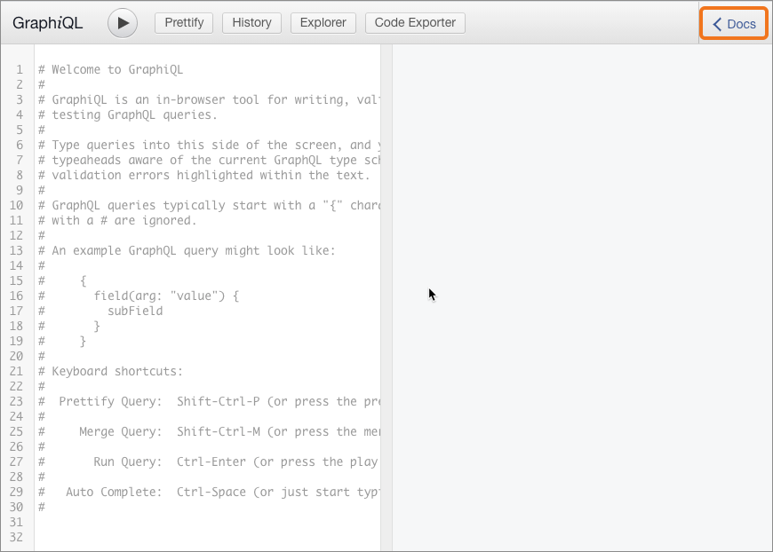

# Explore the GraphQL schema

One of the great features of a GraphQL API is that it offers "introspection"—you can explore the graph (by making API calls) to see the available data sets, the fields and their types, and the operations you can perform.

[GraphiQL]([GraphiQL](https://github.com/graphql/graphiql/tree/main/packages/graphiql#readme)) uses introspection to provide the **Documentation Explorer** so that you can visually browse the Analytics schema, including available data sets (nodes) and available fields.

This article provides an introduction to the GraphQL Documentation Explorer.

## Prerequisites

Before you begin, [configure the API endpoint and HTTP headers](/graphql-api/getting-started/authentication/graphql-client-headers) in the GraphQL client.

## Open the Documentation Explorer

To open the GraphiQL Documentation Explorer, click the **Docs** link in header of the response pane:



A list of available objects displays. The objects in the list follow this syntax:

```
object-name: object-type-definition
```

## Find the type definition of an object

When you first open the **Documentation Explorer** pane, the `mutation` and `query` root types display:


In this example `query` is the name of a root, and `Query` is the type definition.

## Find the fields available for a given type definition

Click on the **type definition** of a node to view the fields that it provides. The **Documentation Explorer** pane also displays descriptions of the nodes.

For example, click the **Query** type definition. The **Documentation Explorer** panel displays the fields that Query` provides. In this example, the fields are `cost` and `viewer`.


## Find the arguments associated with a field

Click the type definition of the `viewer` field to list its sub-fields. The `viewer` field provides sub-fields that allow you to query `accounts` or `zones` data:


The `accounts` and `zones` fields take arguments to specify which data set to query.

For example, the `zones` can take a filter of `ZoneFilter_InputObject` type as an argument. To view the fields available to filter, click **ZoneFilter_InputObject**.

To limit the amount of search results that the query returns, click the **limit** argument.

## Find the search nodes available for a zone

To view a list of the data sets available for a zone, click on the `zones` type definition after the colon (`:`) in the `zones` field:


A list of **search nodes** displays, with a brief description of their behavior and a list of valid arguments. Arguments that end with an exclamation mark (`!`) are required.


Refer to [_Data Sets (tables)_](/graphql-api/features/data-sets) for details on nomenclature and behavior of these nodes.

To view the fields available for a particular data set, click on its type definition. If you click on the **ZoneFirewallEventsAdaptive** type definition in the  **firewallEventsAdaptive** node, a list of fields is displayed:


